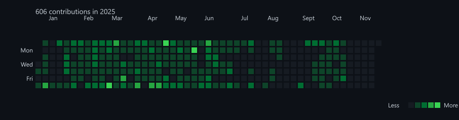

## Introduction

gitcontribgraph is a  command line application to generate a Github style contribution image based on commits to one or more local git repositories.

## Compiling

To clone and run this application, you'll need [Git](https://git-scm.com) and [.NET](https://dotnet.microsoft.com/) installed on your computer. From your command line:

```
# Clone this repository
$ git clone https://github.com/btigi/gitcontribgraph

# Go into the repository
$ cd src

# Build  the app
$ dotnet build
```

## Usage

gitcontribgraph is a command line application and should be run from a terminal session. Application usage is

```
Usage: GitContribGraph [options]

  -i, --input <input> (REQUIRED)  Path to the git repository directory
  -o, --output <output>           Output filename for the PNG image [default: output.png]
  -s, --start-date <YYYY-MM-DD>   Start date for counting commits (format: YYYY-MM-DD)
  -e, --end-date <YYYY-MM-DD>     End date for counting commits (format: YYYY-MM-DD)
  -r, --scan-subdirectories       Recursively scan all git repositories in subdirectories and combine their data
                                  [default: False]
  -u, --user <user>               Filter commits by user (matches name or email, case-insensitive)
  --version                       Show version information
  -?, -h, --help                  Show help and usage information
  ```

## Output

  

## Licencing

gitcontribgraph is licenced under the MIT license. Full license details are available in license.md